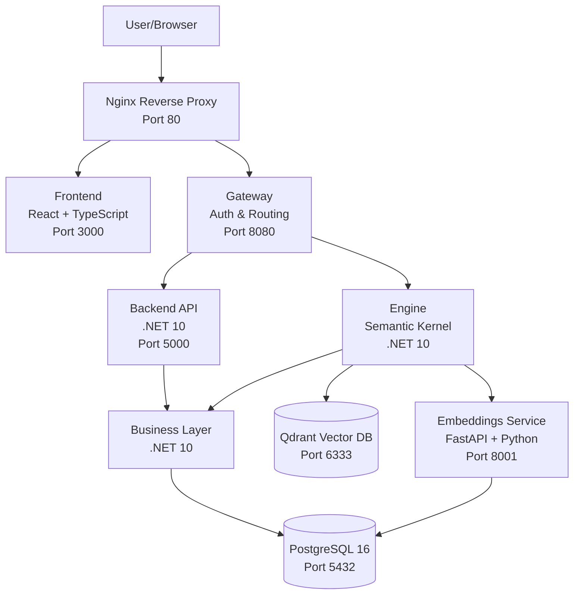

# Semantic Kernel Application

Welcome to the Semantic Kernel Application documentation - a production-grade, high-performance AI application built with clear separation of concerns and optimized for low footprint.

## Quick Links

- [Architecture Overview](architecture/overview.md) - System design and component interactions
- [Getting Started](getting-started/installation.md) - Installation and setup guide
- [Configuration Files](configuration/yaml-files.md) - YAML configuration reference
- [Dockerfiles](dockerfiles/overview.md) - Container image documentation
- [API Reference](api/backend.md) - REST API endpoints
- [Development Guide](development/setup.md) - Developer setup and workflows
- [Python CLI](cli/python-cli.md) - Command-line interface tools

## Project Structure

```
semantic-kernel-app/
├── .config/              # YAML configuration files
│   ├── cli.yml          # CLI tool configuration
│   ├── semantic-kernel.yml  # AI/kernel settings
│   ├── services.yml     # Service resource configs
│   └── infrastructure.yml   # Network/logging/monitoring
├── .devcontainer/       # Development container setup
├── .github/             # GitHub workflows and Copilot config
├── .vscode/             # VS Code settings and tasks
├── dockerfiles/         # Centralized Dockerfile definitions
├── docs/                # MkDocs documentation
├── infrastructure/      # Database schemas and Nginx config
├── semantic/            # Semantic-specific configurations
│   ├── vector/         # Qdrant vector database config
│   └── embeddings/     # Embedding service config
├── src/                 # Source code
│   ├── backend/        # .NET 10 Web API
│   ├── business/       # Business logic layer
│   ├── engine/         # Semantic Kernel service
│   │   └── kernels/    # Kernel implementations
│   ├── frontend/       # React + TypeScript SPA
│   └── gateway/        # API Gateway with auth
├── tests/               # E2E and integration tests
└── tools/               # Python CLI and utilities
```

## Key Features

### 🚀 Microservices Architecture

Clean separation of frontend, backend, engine, business logic, gateway, vector database, and embeddings service.

### 🐳 Containerized Deployment

Docker Compose-based orchestration with Alpine images for minimal footprint (~9.75 CPUs, ~5.75GB RAM total).

### 🗄️ Database Layer

PostgreSQL 16 with stored procedures for authentication, sessions, and data management.

### 🔐 Security

API Gateway with authentication, role-based access control, and secure token management.

### 🤖 AI Capabilities

- **Semantic Kernel**: .NET 10 implementation with multiple kernel types
- **Vector Database**: Qdrant for semantic search (1536 dimensions)
- **Embeddings**: FastAPI service with OpenAI text-embedding-3-small
- **Planners**: Sequential, Action, and Stepwise planners

### 📊 Observability

Comprehensive logging, health checks, and monitoring across all services.

### 🛠️ Developer Experience

- VS Code configuration with AI-optimized settings
- .NET local tools manifest
- EditorConfig for consistent coding standards
- GitHub Copilot integration
- Python CLI for operations

## Architecture Overview



## Services Overview

| Service        | Technology            | Port | Purpose             | Resource Limit      |
| -------------- | --------------------- | ---- | ------------------- | ------------------- |
| **Frontend**   | Node 20 Alpine        | 3000 | React SPA UI        | 1 CPU, 512MB RAM    |
| **Backend**    | .NET 10 Alpine        | 5000 | REST API            | 1 CPU, 512MB RAM    |
| **Engine**     | .NET 10 Alpine        | -    | Semantic Kernel AI  | 2 CPUs, 1GB RAM     |
| **Business**   | .NET 10 Alpine        | -    | Business Logic      | 0.5 CPU, 512MB RAM  |
| **Gateway**    | .NET 10 Alpine        | 8080 | Auth & Routing      | 0.5 CPU, 256MB RAM  |
| **Database**   | PostgreSQL 16         | 5432 | Data Persistence    | 2 CPUs, 2GB RAM     |
| **Vector**     | Qdrant 1.7.4          | 6333 | Vector Search       | 1 CPU, 512MB RAM    |
| **Embeddings** | Python 3.14 + FastAPI | 8001 | Generate Embeddings | 2 CPUs, 2GB RAM     |
| **Nginx**      | Alpine                | 80   | Reverse Proxy       | 0.5 CPU, 256MB RAM  |
| **DevSite**    | MkDocs Material       | 8000 | Documentation       | 0.25 CPU, 128MB RAM |

## Configuration Files

### Root `.config/` Directory

All YAML configuration files are centralized in `.config/`:

- **[cli.yml](configuration/yaml-files.md#cli-configuration)** - CLI tool settings, commands, API endpoints
- **[semantic-kernel.yml](configuration/yaml-files.md#semantic-kernel-configuration)** - AI kernel settings, plugins, planners
- **[services.yml](configuration/yaml-files.md#services-configuration)** - Service resource allocation and limits
- **[infrastructure.yml](configuration/yaml-files.md#infrastructure-configuration)** - Network, logging, monitoring

### Semantic Configurations

- **[semantic/vector/config.yml](configuration/yaml-files.md#vector-database-configuration)** - Qdrant vector database settings
- **[semantic/embeddings/config.yml](configuration/yaml-files.md#embeddings-configuration)** - Embedding service configuration

## Dockerfiles

All Dockerfiles are centralized in the `dockerfiles/` directory using Alpine base images for minimal footprint:

- [Backend](dockerfiles/services.md#backend-dockerfile) - .NET 10 Web API
- [Engine](dockerfiles/services.md#engine-dockerfile) - Semantic Kernel service
- [Business](dockerfiles/services.md#business-dockerfile) - Business logic layer
- [Frontend](dockerfiles/services.md#frontend-dockerfile) - React + Vite
- [Gateway](dockerfiles/services.md#gateway-dockerfile) - API Gateway
- [Database](dockerfiles/services.md#database-dockerfile) - PostgreSQL with stored procedures
- [Vector](dockerfiles/services.md#vector-dockerfile) - Qdrant vector database
- [Embeddings](dockerfiles/services.md#embeddings-dockerfile) - FastAPI embedding service
- [Nginx](dockerfiles/services.md#nginx-dockerfile) - Reverse proxy
- [DevSite](dockerfiles/services.md#devsite-dockerfile) - MkDocs documentation
- [Runner](dockerfiles/services.md#runner-dockerfile) - GitHub Actions runner

## Next Steps

!!! tip "Get Started in 5 Minutes"
Install and configure the application with Docker Compose

    [Installation Guide →](getting-started/installation.md){ .md-button .md-button--primary }

!!! info "Architecture Deep Dive"
Understand the system design and component interactions

    [Architecture Overview →](architecture/overview.md){ .md-button }

!!! note "Configuration Reference"
Explore YAML configuration files and environment variables

    [Configuration Files →](configuration/yaml-files.md){ .md-button }

!!! example "Development Setup"
Set up your development environment with VS Code and tools

    [Development Guide →](development/setup.md){ .md-button }
